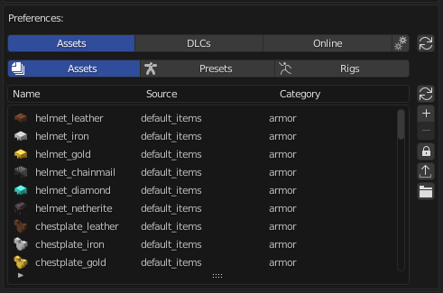
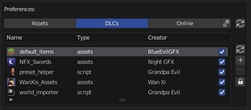
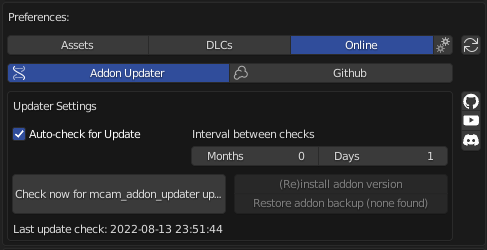
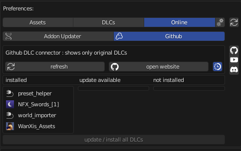
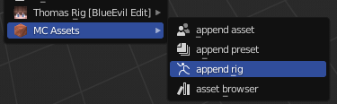
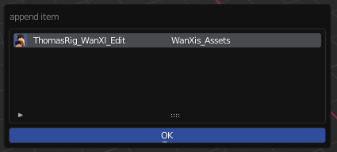
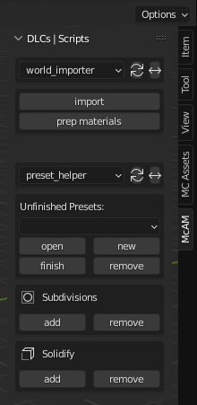
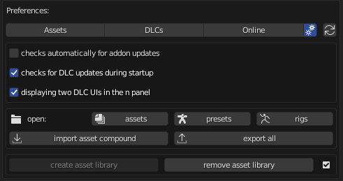
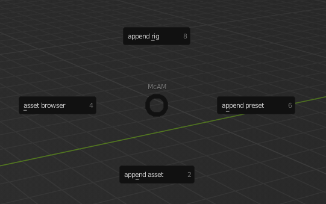
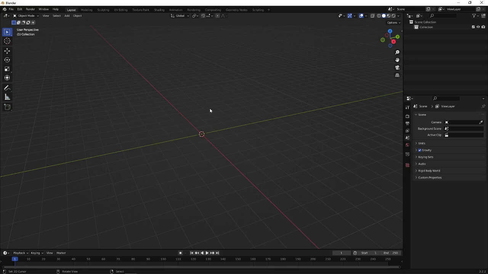

# 🧭 Navigation

    <pre><a href="README.md">Addon Overview</a>    ●    <a href="addon_guide.md">Addon Guide</a>    ●    <a href="dlc_guide.md">DLC Guide</a></pre>

 

# 🏷 Summary
* [Adding/Removing Assets](#addingremoving-assets)
* [Adding DLCs](#adding-dlcs)
* [Adding Updater](#addon-updater)
* [Original DLC Manager](#original-dlc-manager)
* [Appending](#appending)
* [UI](#ui)
* [Settings](#settings)
* [Hotkeys](#hotkeys)

## Adding/Removing Assets

For adding assets you will go to the Assets tab as shown in the picture. There you will find three differnt sub-tabs, each dedicated to their own group of assets --> presets, assets and rigs.

For adding an asset to such a group, you go to the dedicated tab and click on the + next to the UI list above the - button. Then you will choose a filepath and then you confirm your addition to the "storage" of McAM. This can also be a .zip file, which contains blend files. Very important for this is that you have to make all external files internal. That means you need to pack your images etc. first. Quick tip: for this you can also select multiple blend files at once.

For removing you will have to first unlock the remove operator with the little lock beneath it. Then you select the asset you want to remove in the list and click on the - to remvove it completely. This is an operation that can not be redo! So please only remove a file if you are sure you want to remove it. Therefore I suggest to let the lock be locked all the time when you do not want to remove any file. Then you will find the "export" button. You can export your personal assets here into a zip file. Assets from DLCs wont be exported since they are not created by you or maybe are privat.

Last but not least for adding assets is the "main-add" operator. It is the button that looks like a DNA helix and a small +. With this, you can add either a preset, asset or a rig. But you have to choose to which group you want to add it. Furthermore, you are able to add an icon to it too. Just follow the instructions that are written in the add operator when you choose your file. This setting is optional!
  

## Adding DLCs

The same system of adding an assets applies to adding a DLC. The only exception is that you cannot export any DLCs! DLCs are asset packs created by users or even me. If a DLC has any settings of its own they will be displayed beneath the whole UI list. You can disable a DLC by clicking on its checkmark box. This will disable all functionalities of it.  
  
  

## Addon Updater

This is the place where you will find the addon updater settings. It will check for updates in the background if the settings "Auto-check for Update" is enabled. Or you check manually for it with the dedicated button.
  
  
  
  

## Original DLC Manager

The original DLCs are created by BlueEvilGFX (the developer of this addon). Because of that, you can access and download his DLCs directly through the addon. The installation is very easy since you can install it with one click if you are connected to the internet. It will download the DLC source file from the dedicated [GitHub Repo](https://github.com/BlueEvilGFX/McAM-DLCs).
You can also just update/install all of them with the operator at the bottom.
  
  
  
  

## Appending

To append any asset you have to open the "shift-a" menu. You will find all the appending related operators there.
When you then have opened any append list, you can open the small triangle on the left bottom side. You have now access to the filtering and search functions of the list. You can search for items, invert the search and search for a DLC. For appending any item you select the asset you want in the UI list and click on OK. Your item should now be in your scene.
  
  

## UI

In the n panel are the UIs of the DLCs. You can have two slots for different dlc UIs. You can display any UI of the scripted DLCs --> choose with the dropdown list! The double sided arrow marks the operator for changing both slots.
  
  

## Settings

You will find some main settings of McAM here.
  
  
  
  

## Hotkeys

For opening the pie menu press `shift ctrl a`.
You can open and close the asset browser with this operator in the pie menu.
